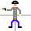

# so_long

The idea is to create a 2D game in C with the help of the minilibX and X11 graphic server. The player has to collect the "collectibles" before he can leave the map through the exit(s). The map is a file ".ber" loaded as an argument of the executable. The number of moves are counted and the goal is to join the exit with the minimum number of moves.  
This project only works on Linux and WSL, make sur you have installed the required elements to run the minilibX. For more information, check : https://github.com/42Paris/minilibx-linux  
All map errors like: invalid character, no exit, etc, need to be handle.  
I added some ennemies and player animations.





I added animation on the coin and the exit when all coins have been collected.


### Steps to run the game
```bash
$> make bonus

$> ./so_long_bonus maps/map_standard_bonus.ber
```

### Controls
WASD

### My ugly game (yes, I made the textures myself...)


